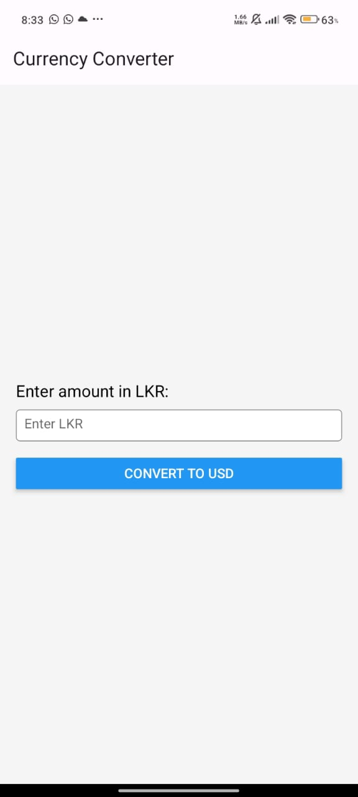
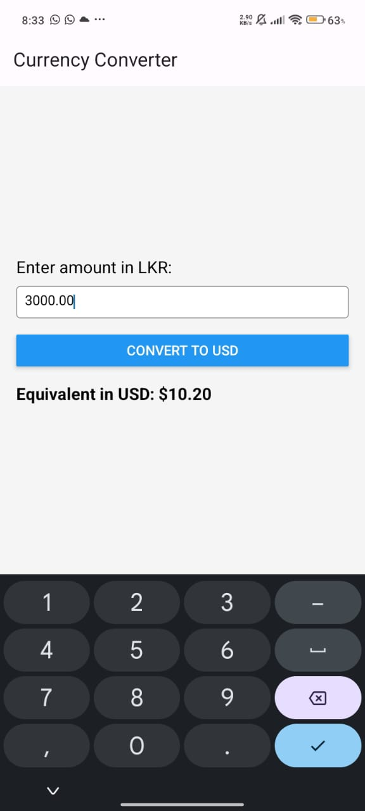

# Currency Converter App (LKR to USD)

This project is a React Native application for converting Sri Lankan Rupees (LKR) to United States Dollars (USD). The app demonstrates the use of React Native components, React Native Paper for UI design, and state management in React.

## Features 🌐

- Convert LKR to USD with real-time calculations 📈
- Input field for LKR amount ✏️
- Displays the converted amount in USD 💵
- User-friendly UI with theming using `react-native-paper`

## Installation 🛠️

Follow these steps to set up and run the project locally:

### Prerequisites 🔧

- Node.js (latest LTS version recommended)
- npm or yarn
- Expo CLI (`npm install -g expo-cli`)
- A mobile device with the Expo Go app installed (available on [iOS](https://apps.apple.com/app/expo-go/id982107779) and [Android](https://play.google.com/store/apps/details?id=host.exp.exponent))

### Steps to Run Locally

1. Clone the repository:

   ```bash
   git clone <repository-url>
   cd <repository-folder>
   ```

2. Install dependencies:

   ```bash
   npm install
   ```

3. Start the development server:

   ```bash
   npx expo start
   ```

4. Open the Expo Go app on your mobile device.

5. Scan the QR code displayed in the terminal or browser to run the app on your device.

## Project Structure 🏛️

```
.
├── components
│   └── Home.js           # Main screen of the currency converter
├── App.js                # Entry point of the application
├── package.json          # Project dependencies and scripts
├── README.md             # Project documentation
└── ...                   # Other configuration and build files
```

## How to Run in Expo App 🎯

1. Install the Expo Go app on your mobile device:

   - [iOS](https://apps.apple.com/app/expo-go/id982107779)
   - [Android](https://play.google.com/store/apps/details?id=host.exp.exponent)

2. Start the Expo development server:

   ```bash
   npx expo start
   ```

3. Scan the QR code from your terminal or browser using the Expo Go app.

4. The app will load and run directly on your mobile device.

## Technologies Used 📊

- React Native
- Expo
- React Native Paper
- React Native Safe Area Context

## OutPut ✨




---

Enjoy converting currencies seamlessly! ✨
